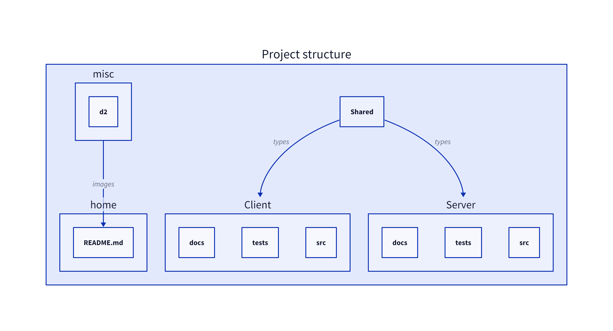
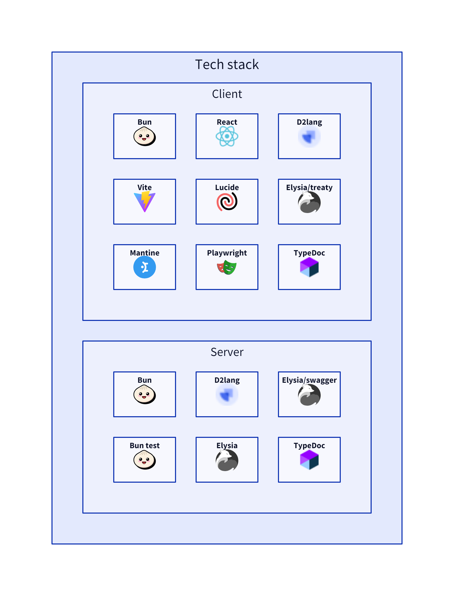

# Preact Project Template

This is a template for a Preact project. It allows the client either to be standalone or to be a client for a server.

There are 4 links, each link corresponding to `Preact`/`React` `Full`/`Light` Template.

|  |  |
| :---------------------------------------------: | :-----------------------------------------------: |
|                      Full                       |                       Light                       |

### [Try it online](https://nicolasventer.github.io/Preact-Project-Template/)

The `React versions` are using the custom hook `useReact`. This hook ensure the re-render of the component when the signal is changed.

There is also another custom hook called `useReactSignal`. It is a wrapper around `useState` that returns an object with the property value that is an accessor (get and set) for the state.

**Note:** memo is not used in React version.

The `Light versions` remove the dependencies with `elysia`, `typebox`, `mantine`, `react-hot-toast`, `lucide-react` and `react-icons`.

## Links

- [Preact Full Template](https://github.com/nicolasventer/Preact-Project-Template/tree/preact/full)
- [Preact Light Template](https://github.com/nicolasventer/Preact-Project-Template/tree/preact/light)
- [React Full Template](https://github.com/nicolasventer/Preact-Project-Template/tree/react/full)
- [React Light Template](https://github.com/nicolasventer/Preact-Project-Template/tree/react/light)

## Features

- [x] Hot reload (client)
- [x] Watch mode (server)
- [x] Client side rendering
- [x] Tests (server and client)
- [x] Code coverage (server and client)
- [x] Documentation (server and client)
- [x] Linting (server and client)

## Installation

### Requirements

```sh
npm install -g bun
npm install -g serve
```

### On Windows:

#### Installation

```bat
git clone https://github.com/nicolasventer/Preact-Project-Template
cd Preact-Project-Template
all_init_on_cloned.bat
```

The script will create a symbolic link between the `Common` folder of the `Client` and `Server` folders and then install the dependencies.  
If you want to install the dependencies manually, you should at least create the symbolic link:

```bat
mklink /J "Client/src/Common" "Server/src/Common"
```

### On Linux

#### Installation

```sh
git clone https://github.com/nicolasventer/Preact-Project-Template.git
cd Preact-Project-Template
./all_init_on_cloned.sh
```

The script will create a symbolic link between the `Common` folder of the `Client` and `Server` folders and then install the dependencies.  
If you want to install the dependencies manually, you should at least create the symbolic link:

```sh
cd ../Client/src
ln -s ../../Server/src/Common .
```

## Usage

### Client only (useful for hot reload that keeps the state)

#### Development

In the Client folder:

```sh
bun run dev
```

**WARNING:** Be sure to be exactly in the Client folder, otherwise you will have page not found error.

*Access the client at http://localhost:5173*

#### Production

In the Client folder, run:

```sh
bun run build
bun run preview
# bun run doc # for documentation
```

*Access the client at http://localhost:4173*

#### Deployment

In the Client folder, run:

```sh
bun run build
```

Then serve `index.html` and `dist` folder (and optionally the `docs` folder) (for example push on GitHub pages).

### Server and Client

#### Development

In the Client folder, run:

```sh
bun run watch
```

In the Server folder, run:

```sh
bun run dev
```

*Note: The client changes will be loaded on the refresh of the page.*

#### Production

In the Client folder:

```sh
bun run build
```

*Client is not accessible yet.*

In the Server folder, run:

```sh
bun run start
```

*Note: You can rebuild the client at any time, the server will serve the new files.*

*Access the server at http://localhost:3000/status*

*Access the client at http://localhost:3000*

#### Deployment

Take `index.html` and `dist` folder from the client and the server code and execute the server.  
You can also take the `docs` folder from the client.

-----

## Project structure



## Tech stack



## Deployment

### Deployed client

In the Client folder, run:

```sh
bun run build
bun run preview
```

*Access the client at http://localhost:4173*

In the Server folder, run:

```sh
bun run start
```

*Access the server at http://localhost:3000/status*


### Client Side Rendering

In the Client folder, run:

```sh
bun run build
```

*Client is not accessible yet.*

In the Server folder, run:

```sh
bun run start
```

*Access the server at http://localhost:3000/status*

*Access the client at http://localhost:3000*


